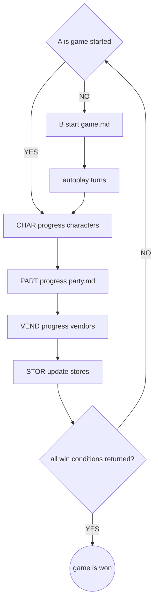

```mermaid
flowchart TD
    A{A is game started};

    B1[B start game.md];
    B2[autoplay turns];

    CHAR[CHAR progress characters];

    PART[PART progress party.md];

    STOR[STOR update stores];

    VEND[VEND progress vendors];

    F{all win conditions returned?}

    G((game is won))

    A -- NO --> B1;
    A -- YES --> CHAR;

    B1 --> B2;
    B2 --> CHAR;

    CHAR --> PART;

    PART --> VEND;

    VEND --> STOR;

    STOR --> F;

    F -- NO --> A;
    F -- YES --> G;
```