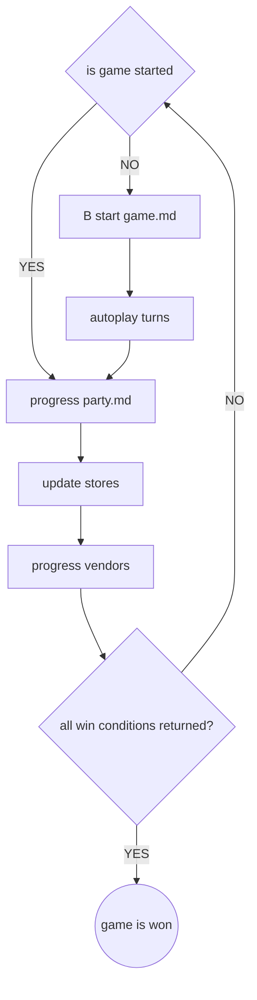

```mermaid
flowchart TD
    A{is game started};

    B1[B start game.md];
    B2[autoplay turns];

    C[progress party.md];

    D[update stores];

    E[progress vendors];

    F{all win conditions returned?}

    G((game is won))

    A -- NO --> B1;
    A -- YES --> C;

    B1 --> B2;
    B2 --> C;

    C --> D;

    D --> E;

    E --> F;

    F -- NO --> A;
    F -- YES --> G;
```