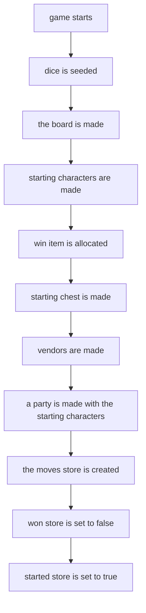

```mermaid
graph TD;
    A[game starts];
    
    A-->B[dice is seeded];
    B-->C[the board is made];
    C-->D[starting characters are made];
    D-->E[win item is allocated];
    E-->F[starting chest is made];
    F-->G[vendors are made];
    G-->H[a party is made with the starting characters];
    H-->I[the moves store is created];
    I-->J[won store is set to false];
    J-->K[started store is set to true];
```

Last updated: 20221119 1351