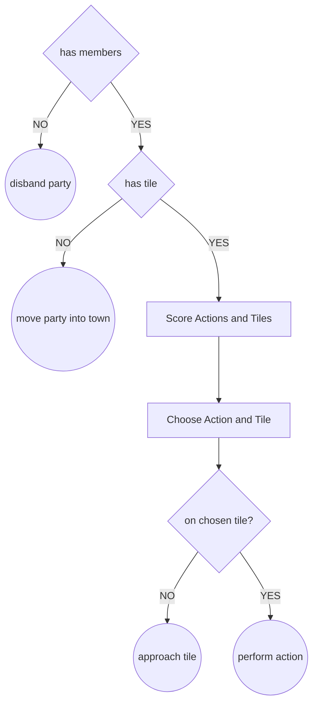

```mermaid
flowchart TD
    A{has members};
    B((disband party));
    C{has tile}
    
    A -- NO --> B;
    A -- YES --> C;

    D((move party into town))
    E[Score Actions and Tiles]

    C -- NO --> D;
    C -- YES --> E;

    F[Choose Action and Tile]

    E --> F;

    G{on chosen tile?}

    F --> G;

    H((perform action))
    I((approach tile))

    G -- NO --> I;
    G -- YES --> H;
```